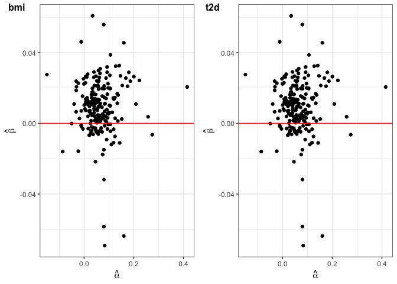
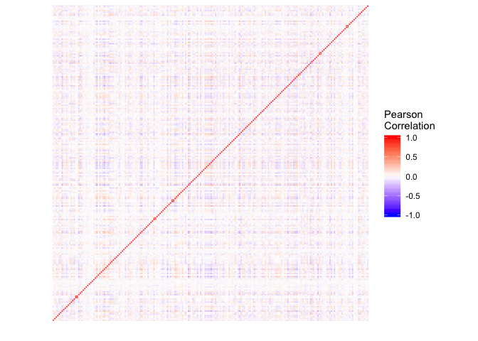

<!-- README.md is generated from README.Rmd. Please edit that file -->

# hJAM

<!-- badges: start -->

[](https://github.com/lailylajiang/hJAM)
<!-- badges: end -->

<!-- CRAN badges: start -->

[](https://CRAN.R-project.org/package=hJAM)[](https://CRAN.R-project.org/package=hJAM)
<!-- CRAN badges: end -->

hJAM is a hierarchical model which unifies the framework of Mendelian
Randomization and Transcriptome-wide association studies.

## Installation

You can install the published version of hJAM from CRAN with:

``` r
install.packages("hJAM")
```

Or you can install the development version from
[GitHub](https://github.com/lailylajiang/hJAM) with:

``` r
if (!require("devtools")) { install.packages("devtools") } else {}
devtools::install_github("lailylajiang/hJAM")
```

## Example

This is a basic example of fitting hJAM model:

``` r
library(hJAM)
# Download the data for data example 2 from the package
data(Gl)
data(betas.Gy)
data(marginal_A)
```

If you don’t have conditional A matrix, you can use `get_cond_A` (if
more than one X) or `get_cond_alpha` (if only one X) to convert the
marginal effects to conditional A matrix with the reference
panel.

``` r
conditional_A = get_cond_A(marginal_A = marginal_A, Gl = Gl, N.Gx = 339224, ridgeTerm = T)
conditional_alpha = get_cond_alpha(alphas = marginal_A[, 1], Gl = Gl, N.Gx = 339224, ridgeTerm = T)
```

After obtained the conditional A matrix, fit hJAM model with function
`hJAM_lnreg`.

``` r
# fit the hJAM model
hJAM_lnreg(betas.Gy = betas.Gy, Gl = Gl, N.Gy = 459324, A = conditional_A, ridgeTerm = T)
#> ------------------------------------------------------ 
#>                    hJAM output                         
#> ------------------------------------------------------ 
#> Number of SNPs used in model: 210 
#> 
#>     Estimate StdErr         95% CI       Pvalue
#> bmi    0.322  0.061 (0.222, 0.422) 1.268210e-07
#> t2d    0.119  0.017 (0.091, 0.147) 3.176604e-12
#> ------------------------------------------------------
```

In the package, you could also implement hJAM with Egger regression,
which is designed to detect the unmeasured pleiotropy effect. The
function for hJAM with Egger regression is `hJAM_egger`.

``` r
# fit the hJAM model
hJAM_egger(betas.Gy = betas.Gy, Gl = Gl, N.Gy = 459324, A = conditional_A, ridgeTerm = T)
#> ------------------------------------------------------ 
#>                    hJAM egger output                   
#> ------------------------------------------------------ 
#> Number of SNPs used in model: 210 
#> 
#>     Estimate StdErr         95% CI       Pvalue
#> bmi    0.302  0.070 (0.186, 0.417) 1.841101e-05
#> t2d    0.107  0.027 (0.063, 0.151) 5.839645e-05
#> 
#> Intercept
#>      Est.Int StdErr.Int 95% CI.Int        Pvalue.Int
#> [1,] "0.453" "0.787"    "(-0.841, 1.748)" "0.565"   
#> ------------------------------------------------------
```

The user could use `SNPs_heatmap` and `SNPs_scatter_plot` to display the
correlation and pattern of the SNPs that the user used in the
analysis.

``` r
scatter_plot_p = SNPs_scatter_plot(A = conditional_A, betas.Gy = betas.Gy, num_X = 2)
scatter_plot_p
```



``` r
heatmap_p = SNPs_heatmap(Gl)
heatmap_p
```


